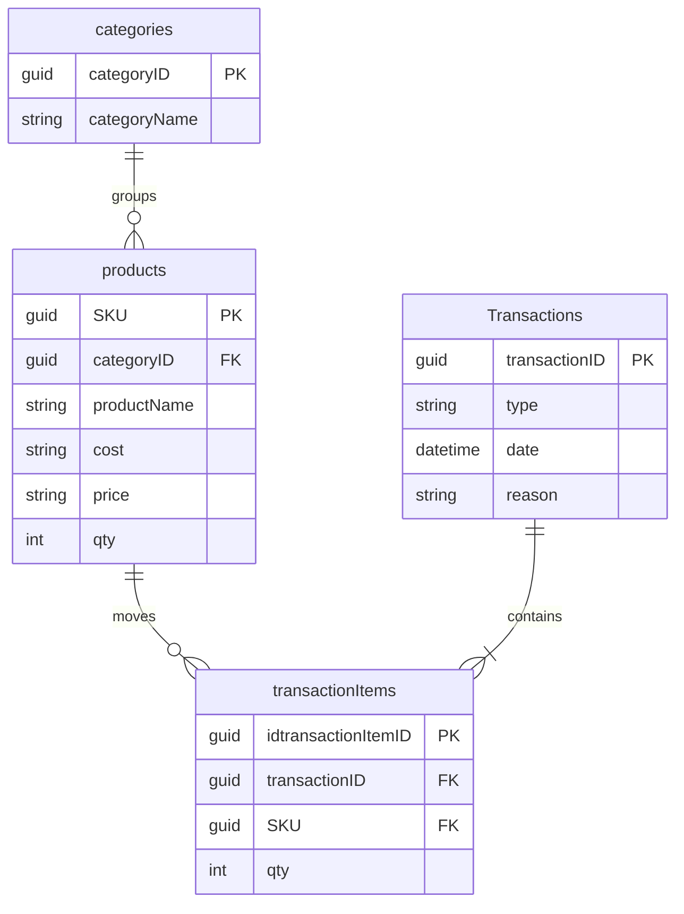

# คู่มือ Inventory API

ใช้ API นี้จัดการ **หมวดหมู่ สินค้า และรายการรับเข้า/จ่ายออก** ตัวอย่างด้านล่างใช้ URL หลัก `http://localhost:5126` หากต้องการลองส่งคำขอผ่านหน้าเว็บ เปิด [Swagger UI](http://localhost:5126/swagger) หลังเริ่มระบบ

## สิ่งที่ต้องใส่ในคำขอ

| รายการ | ค่า |
| --- | --- |
| URL หลัก | `http://localhost:5126` |
| Header สำหรับ `POST`, `PUT` และ `PATCH` | `Content-Type: application/json` |
| Header สำหรับ `GET` และ `DELETE` | ไม่มีที่จำเป็น |

ระบบยังไม่ต้องใช้รหัสผ่านหรือ `Authorization` header ค่า `{id}` และ `{sku}` ใน URL ให้แทนด้วยรหัสที่ได้จากการสร้างหรือเรียกดูข้อมูล

## URL และ Method

| Method | URL | ใช้ทำอะไร | สำเร็จ | ข้อผิดพลาดที่พบได้ |
| --- | --- | --- | --- | --- |
| GET | `/api/categories` | ดูหมวดหมู่ทั้งหมด | 200 | — |
| GET | `/api/categories/{id}` | ดูหมวดหมู่หนึ่งรายการ | 200 | 404 |
| POST | `/api/categories` | เพิ่มหมวดหมู่ | 201 | 400 |
| PUT | `/api/categories/{id}` | แก้ไขหมวดหมู่ | 204 | 400, 404 |
| DELETE | `/api/categories/{id}` | ลบหมวดหมู่ | 204 | 404, 409 |
| GET | `/api/products` | ดูสินค้าทั้งหมด | 200 | — |
| GET | `/api/products/{sku}` | ดูสินค้าหนึ่งรายการ | 200 | 404 |
| GET | `/api/products/low-stock` | ดูสินค้าที่เหลือน้อยกว่า 5 ชิ้น | 200 | — |
| POST | `/api/products` | เพิ่มสินค้า | 201 | 400 |
| PUT | `/api/products/{sku}` | แก้ไขสินค้า | 204 | 400, 404 |
| DELETE | `/api/products/{sku}` | ลบสินค้า | 204 | 404, 409 |
| PATCH | `/api/stock/adjust` | ปรับจำนวนสต็อกและบันทึกประวัติ | 200 | 400, 404, 409 |
| GET | `/api/transactions` | ดูรายการเคลื่อนไหวทั้งหมด | 200 | — |
| GET | `/api/transactions/{id}` | ดูรายการเคลื่อนไหวหนึ่งรายการ | 200 | 404 |
| POST | `/api/transactions` | บันทึกรายการเคลื่อนไหว | 201 | 400 |
| DELETE | `/api/transactions/{id}` | ประวัติห้ามลบ | — | 404, 409 |

`GET` และ `DELETE` ไม่ต้องส่ง Request Body ส่วน `PUT` ต้องส่งข้อมูลใหม่ครบทุกช่องตามตัวอย่าง `204` หมายถึงสำเร็จโดยไม่มี Response Body จำนวนสต็อกใน `PUT /api/products/{sku}` ต้องเท่าเดิม ให้ใช้ `PATCH /api/stock/adjust` เมื่อต้องการเปลี่ยนจำนวน

## โครงสร้างข้อมูลและความสัมพันธ์



หนึ่งหมวดหมู่มีสินค้าได้หลายชิ้น สินค้าหนึ่งรายการมีประวัติได้หลายรายการ และรายการเคลื่อนไหวหนึ่งรายการมีสินค้าได้หลายรายการ `SKU` เป็นรหัสสินค้าแบบ GUID ที่ไม่ซ้ำกันและเป็น Primary Key

## ปรับสต็อกโดยตรง

**Request:** `PATCH /api/stock/adjust` พร้อม `Content-Type: application/json`

```json
{ "productId": "22222222-2222-2222-2222-222222222222", "quantity": -5, "reason": "เบิกไปใช้งาน" }
```

`quantity` เป็นจำนวนเต็มมีเครื่องหมาย: บวกคือรับเข้า ลบคือจ่ายออก และห้ามเป็นศูนย์ การปรับยอดและบันทึกประวัติอยู่ใน database transaction เดียวกัน

**Success — 200 OK:**

```json
{ "productId": "22222222-2222-2222-2222-222222222222", "quantity": 5 }
```

**Error — 400 Bad Request:** ค่า quantity เป็นศูนย์หรือไม่ได้ระบุเหตุผล

```json
"Provide productId, a nonzero quantity, and a reason."
```

**Error — 404 Not Found:** ไม่พบสินค้า

```json
"Product does not exist."
```

**Error — 409 Conflict:** จำนวนที่จ่ายออกมากกว่าคงเหลือ

```json
"Insufficient stock or stock quantity exceeds the allowed range."
```

`GET /api/products/low-stock` ส่ง `200 OK` เป็น array ของสินค้าในรูปแบบเดียวกับ `GET /api/products` โดยเลือก `qty < 5` รวมสินค้าที่เหลือศูนย์

## ตัวอย่าง Request และ Response

รหัสในตัวอย่างเป็นเพียงตัวอย่าง ให้ใช้รหัสจริงที่ API ส่งกลับเมื่อใช้งาน

### 1. หมวดหมู่

**Request:** `POST /api/categories` พร้อม header `Content-Type: application/json`

```json
{ "categoryName": "เครื่องเขียน" }
```

**Success — 201 Created** (`Location` ชี้ไปยังหมวดหมู่ที่สร้าง)

```json
{ "categoryId": "11111111-1111-1111-1111-111111111111", "categoryName": "เครื่องเขียน" }
```

`GET /api/categories/{id}` ส่งข้อมูลรูปแบบเดียวกัน ส่วน `GET /api/categories` ส่งเป็นรายการ เช่น `[{"categoryId":"11111111-1111-1111-1111-111111111111","categoryName":"เครื่องเขียน"}]` หากไม่มีข้อมูลจะได้ `[]`

**Error — 409 Conflict:** ลบหมวดหมู่ที่ยังมีสินค้าไม่ได้

```json
"Category is used by products."
```

### 2. สินค้า

**Request:** `POST /api/products` พร้อม header `Content-Type: application/json`

```json
{
  "categoryId": "11111111-1111-1111-1111-111111111111",
  "productName": "สมุด",
  "qty": 10,
  "price": "75.00",
  "cost": "50.00"
}
```

**Success — 201 Created** (`Location` ชี้ไปยังสินค้าที่สร้าง)

```json
{
  "sku": "22222222-2222-2222-2222-222222222222",
  "categoryId": "11111111-1111-1111-1111-111111111111",
  "productName": "สมุด",
  "qty": 10,
  "price": "75.00",
  "cost": "50.00"
}
```

`GET /api/products/{sku}` ส่งข้อมูลรูปแบบเดียวกัน ส่วน `GET /api/products` ส่งเป็นรายการ หากไม่มีข้อมูลจะได้ `[]` `qty` เป็นจำนวนเต็มตั้งแต่ 0 ขึ้นไป ราคาขายและต้นทุนต้องส่งเป็นข้อความในเครื่องหมายคำพูด และ `categoryId` ใช้ `null` ได้ เมื่อสร้างสินค้าด้วย `qty > 0` ระบบจะบันทึกประวัติรับเข้าเริ่มต้นด้วย

**Error — 400 Bad Request:** ระบุหมวดหมู่ที่ไม่มีในระบบ

```json
"Category does not exist."
```

**Error — 409 Conflict:** ลบสินค้าที่มีประวัติรายการเคลื่อนไหวไม่ได้

```json
"Product is used by transactions."
```

### 3. รายการรับเข้า/จ่ายออก

**Request:** `POST /api/transactions` พร้อม header `Content-Type: application/json`

```json
{
  "type": "IN",
  "date": "2026-09-29T00:00:00Z",
  "reason": "รับสินค้าเข้า",
  "items": [
    {
      "sku": "22222222-2222-2222-2222-222222222222",
      "categoryId": "11111111-1111-1111-1111-111111111111",
      "qty": 2,
      "price": 75.00
    }
  ]
}
```

ใช้ `IN` สำหรับรับเข้า และ `OUT` สำหรับจ่ายออก `reason` ต้องระบุ `items` ต้องมีอย่างน้อยหนึ่งรายการ โดยแต่ละรายการต้องมี `sku`, `categoryId`, `qty` (จำนวนเต็มมากกว่า 0) และ `price` (0 ถึง 99,999,999.99) ระบบกำหนด `date` เป็นเวลาบันทึกของเซิร์ฟเวอร์และปรับสต็อกพร้อมบันทึกประวัติใน database transaction เดียวกัน

**Success — 201 Created** (`Location` ชี้ไปยังรายการที่สร้าง)

```json
{
  "transactionId": "33333333-3333-3333-3333-333333333333",
  "type": "IN",
  "date": "2026-09-29T00:00:00Z",
  "reason": "รับสินค้าเข้า",
  "items": [
    {
      "idtransactionItemId": "44444444-4444-4444-4444-444444444444",
      "transactionId": "33333333-3333-3333-3333-333333333333",
      "sku": "22222222-2222-2222-2222-222222222222",
      "categoryId": "11111111-1111-1111-1111-111111111111",
      "qty": 2,
      "price": 75.00
    }
  ]
}
```

`GET /api/transactions/{id}` ส่งข้อมูลรูปแบบเดียวกัน ส่วน `GET /api/transactions` ส่งเป็นรายการ หากไม่มีข้อมูลจะได้ `[]`

**Error — 400 Bad Request:** ตัวอย่างเมื่อระบุสินค้าที่ไม่มีในระบบ

```json
"One or more products do not exist."
```

## ความหมายของรหัสตอบกลับ

| รหัส | ความหมาย | รูปแบบ Response |
| --- | --- | --- |
| 200 | อ่านข้อมูลสำเร็จ | JSON ของข้อมูลหรือรายการ |
| 201 | สร้างข้อมูลสำเร็จ | JSON ของข้อมูลที่สร้าง พร้อม `Location` header |
| 204 | แก้ไขหรือลบสำเร็จ | ไม่มี body |
| 400 | ข้อมูลที่ส่งไม่ถูกต้อง | ข้อความ JSON หรือรายละเอียดช่องที่ผิด |
| 404 | ไม่พบรหัสที่ระบุ | ไม่มี body |
| 409 | ลบไม่ได้เพราะข้อมูลยังถูกใช้งาน | ข้อความ JSON |

ตัวอย่าง **400** เมื่อไม่ส่งชื่อสินค้า:

```json
{
  "title": "One or more validation errors occurred.",
  "status": 400,
  "errors": { "ProductName": ["The ProductName field is required."] }
}
```

ข้อความและรายละเอียดใน `errors` อาจต่างกันตามข้อมูลที่ส่ง
